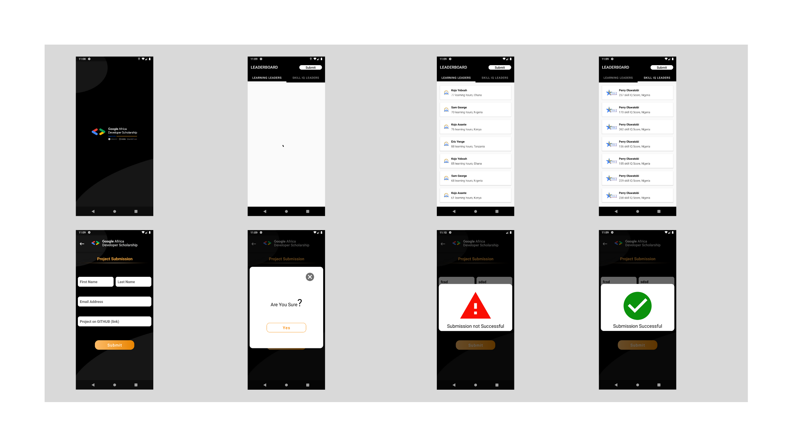

# GadsApp ✓

My Associate Android Developer Practice Project

## Getting Started

Fork the project and run on your device

## Prerequisites

A prior knowledge of Android Application development 🙂

## What I learnt

- Multi-Activity ProjecT
- View pager
- Customizing Toolbar
- RecyclerView
- Making Network Request
- Working with Google Form and many more...

## Screen shots

